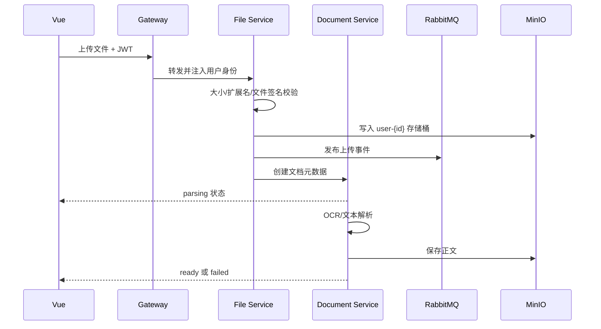
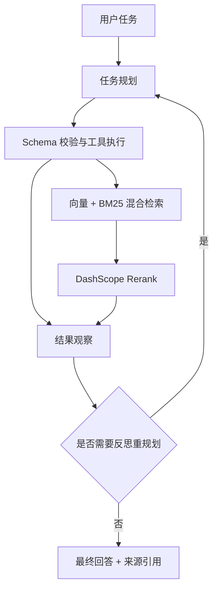

# SmartDoc 架构说明

## 请求链路

1. Vue 前端统一请求 `gateway-service:8080`。
2. 网关验证 JWT，并注入 `X-User-Id`、用户名和角色。
3. 各业务服务再次执行权限校验，文档和文件按用户桶隔离。
4. 上传事件、AI 任务和文档处理通过 RabbitMQ 解耦；可恢复任务状态写入 Redis。
5. 文件正文和原始文件存储在 MinIO，业务元数据存储在 MySQL。

## 文档处理链路

## RAG 与 Agent 链路

索引任务状态为 `PENDING → PARSING → EMBEDDING → INDEXED`，失败进入 `FAILED`，可在工具箱重新提交。

## 数据边界

- MySQL：用户、文件元数据、文档、版本、协作者、审计记录。
- Redis：缓存、会话、Agent 时间线、工具箱任务、索引任务、向量元数据。
- MinIO：原始文件、解析正文、工具结果文件。
- HNSW：进程内语义近邻索引；服务启动后依据持久化数据恢复。

## 可用性

所有业务镜像包含 Actuator 健康检查；Gateway 等待四个业务服务健康后启动。任务结果和索引状态持久化到 Redis，外部模型调用采用有限次数退避重试，并保留失败重试入口。