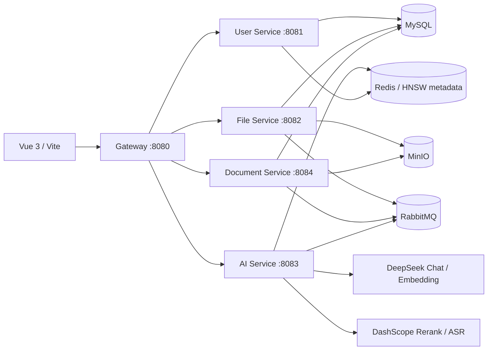

# SmartDoc 文档智能处理平台

SmartDoc 是一个基于 Java 17 与 Spring Cloud 的文档全流程管理和智能分析平台。系统包含用户、文件、文档、AI Agent、RAG 知识库、智能练题和生产力工具箱，并支持 Docker Compose 一键部署。

## 已实现能力

- 文档库：上传、解析状态、图片/PDF 预览、重命名、分类、收藏、回收站、恢复和永久删除。
- AI 对话：DeepSeek 多轮对话、历史会话、选择已有文档、全知识库问答、来源片段引用。
- Agent：任务规划、工具调用、观察、反思重规划、危险操作审批、WebSocket 进度推送。
- RAG：自动/章节/定长/语义分段，DeepSeek Embedding，Redis 元数据持久化，内存 HNSW、BM25 混合检索和 Rerank。
- 工具箱：OCR、PDF 拆分合并、Word/PDF 转换、表格导出 Excel、文档翻译、AI 改写、图片处理、录音会议纪要、思维导图和批处理任务中心。
- 智能练题：多文档题目提取、题型分类、即时判题、DeepSeek 简答评分、进度恢复、错题本、收藏、筛选和报告导出。
- 安全与稳定性：JWT、用户级 MinIO 桶隔离、上传白名单与文件头校验、限时协作授权、Redis 任务恢复、模型重试、Actuator 健康检查和 Prometheus 指标。

## 系统架构



详细链路见 [架构说明](docs/ARCHITECTURE.md)，主要接口见 [API 概览](docs/API.md)。

## 技术栈

- 后端：Java 17、Spring Boot 3.2、Spring Cloud 2023、Spring AI、MyBatis-Plus
- 数据与中间件：MySQL 8、Redis 7、RabbitMQ、MinIO、HNSW
- AI：DeepSeek Chat/Embedding、DashScope Rerank/Qwen ASR、Tesseract OCR
- 前端：Vue 3、Vite 4、Element Plus、Axios
- 部署与监控：Docker Compose、Docker Swarm、Actuator、Prometheus

## 快速启动

### 1. 准备环境变量

在 PowerShell 中执行：

```powershell
Copy-Item .env.example .env
notepad .env
```

至少填写以下变量，值不要提交到 Git：

```dotenv
MYSQL_ROOT_PASSWORD=自行设置
MYSQL_USERNAME=root
MYSQL_PASSWORD=与数据库密码一致
RABBITMQ_DEFAULT_USER=自行设置
RABBITMQ_DEFAULT_PASS=自行设置
RABBITMQ_USERNAME=与上面一致
RABBITMQ_PASSWORD=与上面一致
MINIO_ROOT_USER=自行设置
MINIO_ROOT_PASSWORD=自行设置
MINIO_ACCESS_KEY=与上面一致
MINIO_SECRET_KEY=与上面一致
OPENAI_API_KEY=DeepSeek API Key
DASHSCOPE_API_KEY=阿里云百炼 API Key
```

`.env`、`application-local.yml` 已在 `.gitignore` 中，不会被提交。项目不会提供公开默认密码；首次使用可从注册页面创建账号。

### 2. 编译后端并启动容器

```powershell
.\mvnw.cmd -DskipTests package
docker compose up -d --build
docker compose ps
```

服务显示 `healthy` 后，网关地址为 `http://localhost:8080`。若修改了后端代码，需要重新执行上面的编译和容器构建。

### 3. 启动前端

```powershell
Set-Location .\vue-test-app
npm install
npm run dev
```

浏览器打开 `http://localhost:5173`。

## 常用地址

| 服务 | 地址 |
| --- | --- |
| 前端 | `http://localhost:5173` |
| API 网关 | `http://localhost:8080` |
| MinIO 控制台 | `http://localhost:9001` |
| RabbitMQ 控制台 | `http://localhost:15672` |
| 用户服务 Swagger | `http://localhost:8081/swagger-ui.html` |
| 文件服务 Swagger | `http://localhost:8082/swagger-ui.html` |
| AI 服务 Swagger | `http://localhost:8083/swagger-ui.html` |
| 文档服务 Swagger | `http://localhost:8084/swagger-ui.html` |
| 健康检查 | `http://localhost:8080/actuator/health` |

## 验证与测试

```powershell
# 后端编译
.\mvnw.cmd -DskipTests package

# 全量后端测试（真实模型连通测试默认跳过）
.\mvnw.cmd test

# 手动启用真实 AI 模型连通测试
$env:RUN_AI_INTEGRATION_TESTS = "true"
.\mvnw.cmd -pl ai-service -Dtest=AllModelsTest test

# 前端生产构建
Set-Location .\vue-test-app
npm run build

# Compose 配置检查
Set-Location ..
docker compose config --quiet
```

GitHub Actions 会自动执行后端全量测试与打包、前端构建和 Compose 配置校验。

## 项目结构

```text
SmartDoc/
├─ common/              公共返回、JWT、Feign 与基础配置
├─ gateway-service/     API 网关与统一鉴权
├─ user-service/        用户与登录
├─ file-service/        文件上传、下载、MinIO 元数据
├─ document-service/    文档、OCR、转换、任务中心与协作
├─ ai-service/          Agent、RAG、DeepSeek 与 DashScope
├─ vue-test-app/        Vue 前端
├─ init-db/             MySQL 初始化脚本
├─ docs/                架构和 API 文档
└─ docker-compose.yml   本地完整部署
```

## 数据与安全注意事项

- 不要提交 `.env`、API Key、数据库密码、Token、真实用户数据或 MinIO 数据目录。
- 如果密钥曾经进入 Git 历史，仅删除当前文件不够，应立即吊销旧密钥并清理历史。
- 文件下载必须携带 JWT；用户只能访问自己的存储桶或被授权文档。
- 上传支持常用文档、图片和音频类型，单文件上限默认 100MB，并校验扩展名和文件签名。
- 协作授权可设置 7 天、30 天或永久；过期记录自动失去访问权限。

## 说明

仓库中的性能指标应以可复现压测报告为准。若需要在简历中使用召回率、P95 或成功率数据，请保留测试数据集、脚本、环境参数和原始结果。